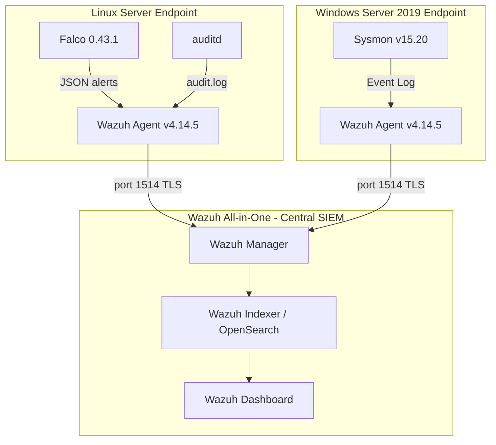

# Wazuh Security Monitoring Implementation

Security monitoring implementation developed for an assurance services client as part of a two-month security engineering engagement. The implementation covers endpoint telemetry collection, centralized log management, and detection engineering across Linux and Windows server environments.

This repository documents the technical architecture, configurations, detection rules, and validation testing conducted during the engagement. The lab environment was built on a cloned infrastructure within Visionet's environment prior to production deployment.

---

## Engagement Context

**Role:** Security Engineer (PT. Visionet Data Internasional)
**Client:** Assurance Services Client
**Duration:** 2 months
**Scope:** Security monitoring implementation using Wazuh as the central SIEM, covering Linux and Windows server endpoints with multi-source telemetry integration

The implementation was preceded by a Proof of Concept phase to validate detection coverage and dashboard functionality before production rollout. This repository reflects the configurations and rules developed and tested during that process.

---

## Architecture

```
+--------------------------------------------------------------+
|             ubnsrv-aio  -  Wazuh All-in-One                  |
|          Manager  .  Indexer  .  Dashboard                   |
|                                                              |
|   Central SIEM receiving telemetry from both endpoints       |
|   Handles log ingestion, correlation, alerting               |
+------------------+---------------------------+---------------+
                   |                           |
          Wazuh Agent v4.14.5         Wazuh Agent v4.14.5
                   |                           |
+------------------v------+   +----------------v--------------+
|  ubnsrv-agent           |   |  winsrv-agent                 |
|  Ubuntu 22.04.5 LTS     |   |  Windows Server 2019 Std      |
|                         |   |                               |
|  - Falco 0.43.1         |   |  - Sysmon v15.20              |
|  - auditd               |   |  - Wazuh Agent                |
|  - Wazuh Agent          |   |                               |
+-------------------------+   +-------------------------------+
```



---

## Environment Inventory

| Host         | Role                              | OS                                              | Wazuh Version | Agent ID     | Status |
|--------------|-----------------------------------|-------------------------------------------------|---------------|--------------|--------|
| ubnsrv-aio   | Wazuh Manager, Indexer, Dashboard | Linux                                           | v4.14.5       | 000 (server) | Active |
| ubnsrv-agent | Linux Server Endpoint             | Ubuntu 22.04.5 LTS, Kernel 5.15.0-179-generic   | v4.14.5       | 001          | Active |
| winsrv-agent | Windows Server Endpoint           | Windows Server 2019 Standard (Build 10.0.17763) | v4.14.5       | 002          | Active |

Full version details in [docs/lab-inventory.md](docs/lab-inventory.md).

---

## Components

| Component       | Version              | Function                                         | Deployed On  |
|-----------------|----------------------|--------------------------------------------------|--------------|
| Wazuh Manager   | v4.14.5              | Log ingestion, rule processing, alert generation | ubnsrv-aio   |
| Wazuh Indexer   | v4.14.5              | Alert storage and search (OpenSearch)            | ubnsrv-aio   |
| Wazuh Dashboard | v4.14.5              | Monitoring interface, investigation, reporting   | ubnsrv-aio   |
| Wazuh Agent     | v4.14.5              | Endpoint log collection and forwarding           | ubnsrv-agent |
| Wazuh Agent     | v4.14.5              | Endpoint log collection and forwarding           | winsrv-agent |
| Falco           | 0.43.1               | Runtime threat detection via eBPF                | ubnsrv-agent |
| auditd          | Ubuntu 22.04 package | Linux syscall auditing                           | ubnsrv-agent |
| Sysmon          | v15.20               | Windows process, network, and file telemetry     | winsrv-agent |

---

## Telemetry Sources and Log Flow

Three independent telemetry sources feed into the central Wazuh instance. Each uses a different collection mechanism.

**Linux endpoint:**

| Source | Collection                                   | Format | Transport              |
|--------|----------------------------------------------|--------|------------------------|
| auditd | localfile - /var/log/audit/audit.log         | audit  | Wazuh Agent, port 1514 |
| Falco  | localfile - /var/log/falco/falco_events.json | json   | Wazuh Agent, port 1514 |

**Windows endpoint:**

| Source          | Collection                                              | Format       | Transport              |
|-----------------|---------------------------------------------------------|--------------|------------------------|
| Sysmon          | eventchannel - Microsoft-Windows-Sysmon/Operational     | eventchannel | Wazuh Agent, port 1514 |
| PowerShell      | eventchannel - Microsoft-Windows-PowerShell/Operational | eventchannel | Wazuh Agent, port 1514 |
| Security Events | eventchannel - Security (filtered)                      | eventchannel | Wazuh Agent, port 1514 |

See [docs/log-flow.md](docs/log-flow.md) for detailed processing flow.

---

## Detection Engineering

### Custom Rules

Custom Wazuh rules were developed to extend detection coverage beyond the built-in ruleset. All rules are MITRE ATT&CK mapped and documented in [docs/custom-rules.md](docs/custom-rules.md).

**Falco integration rules (117000-117003):**

| Rule ID | Condition             | Level | Trigger                                 |
|---------|-----------------------|-------|-----------------------------------------|
| 117000  | Any Falco JSON event  | 6     | Base rule                               |
| 117001  | Priority: Critical    | 10    | XZ backdoor, critical runtime events    |
| 117002  | Priority: Warning     | 7     | Sensitive file reads, account creation  |
| 117003  | Priority: Notice/Info | 5     | Network anomalies, informational events |

**auditd detection rules (210100-210114):**

| Rule ID | Audit Key                                          | Level | MITRE                                          |
|---------|----------------------------------------------------|-------|------------------------------------------------|
| 210100  | etcpasswd, shadow_access                           | 8     | T1003 - OS Credential Dumping                  |
| 210101  | priv_esc                                           | 10    | T1548 - Abuse Elevation Control                |
| 210102  | rootcmd                                            | 9     | T1548.003 - Sudo and Sudo Caching              |
| 210103  | susp_activity                                      | 8     | T1059 - Command and Scripting Interpreter      |
| 210104  | recon                                              | 6     | T1082 - System Information Discovery           |
| 210105  | user_modification, group_modification              | 9     | T1136 - Create Account                         |
| 210106  | sshd                                               | 10    | T1098 - Account Manipulation                   |
| 210107  | remote_shell                                       | 12    | T1059.004 - Unix Shell                         |
| 210108  | cron                                               | 8     | T1053.003 - Cron                               |
| 210109  | modules                                            | 10    | T1547.006 - Kernel Modules and Extensions      |
| 210110  | code_injection, data_injection, register_injection | 12    | T1055 - Process Injection                      |
| 210111  | auditconfig, auditlog                              | 11    | T1070.002 - Clear Linux or Mac System Logs     |
| 210112  | perm_mod                                           | 7     | T1222 - File and Directory Permissions         |
| 210113  | T1011_Exfiltration_Over_Other_Network_Medium       | 10    | T1011 - Exfiltration Over Other Network Medium |
| 210114  | T1081_Credentials_In_Files                         | 8     | T1552.001 - Credentials In Files               |

### Detection Coverage Summary

| Category                 | Source         | Coverage                                                                                   |
|--------------------------|----------------|--------------------------------------------------------------------------------------------|
| Runtime threat detection | Falco          | XZ backdoor patterns, sensitive file access, unexpected network activity, account creation |
| Credential access        | auditd         | /etc/shadow and /etc/passwd access monitoring                                              |
| Privilege escalation     | auditd         | sudo usage, SUID execution, root command tracking                                          |
| Persistence              | auditd         | Cron modification, kernel module loading                                                   |
| Defense evasion          | auditd         | Audit log and config tampering                                                             |
| Process injection        | auditd         | ptrace-based injection (code, data, register)                                              |
| Lateral movement         | auditd         | SSH config modification                                                                    |
| Exfiltration             | auditd         | Raw socket creation monitoring                                                             |
| Windows process activity | Sysmon         | Full command line, hashes (MD5/SHA256/IMPHASH), parent process chain                       |
| PowerShell execution     | Sysmon         | Encoded commands, execution policy bypass, download cradles                                |
| Network connections      | Sysmon         | Outbound and inbound connection logging                                                    |
| Authentication failures  | Wazuh built-in | SSH brute-force, invalid user attempts                                                     |

---

## Validation Testing

All detection scenarios were tested and validated before production handover.

| Test Case                          | Endpoint     | Telemetry Source              | Rule Fired             | Result             |
|------------------------------------|--------------|-------------------------------|------------------------|--------------------|
| /etc/shadow access                 | ubnsrv-agent | auditd (key: etcpasswd)       | 210100, level 8, T1003 | Pass               |
| sudo whoami, sudo id               | ubnsrv-agent | auditd (key: recon + rootcmd) | 210104, 210102         | Pass               |
| curl, wget execution               | ubnsrv-agent | auditd (key: susp_activity)   | 210103, level 8        | Pass               |
| Falco - sensitive file read        | ubnsrv-agent | Falco                         | 117002, level 7        | Pass               |
| Falco - XZ backdoor pattern        | ubnsrv-agent | Falco                         | 117001, level 10       | Pass               |
| Sysmon process creation            | winsrv-agent | Sysmon Event ID 1             | Built-in rules         | Pass               |
| PowerShell -ExecutionPolicy Bypass | winsrv-agent | Sysmon Event ID 1             | 92027, T1059.001       | Pass               |
| PowerShell -EncodedCommand         | winsrv-agent | Sysmon Event ID 1             | Built-in rules         | Pass               |
| PowerShell IEX download cradle     | winsrv-agent | Sysmon Event ID 1 + 3         | Built-in rules         | Pass               |
| Agent connectivity                 | Both         | Wazuh Manager                 | N/A                    | Pass - both Active |

Full test case documentation in [docs/detection-test-cases.md](docs/detection-test-cases.md).

---

## POC Dashboard

A custom security monitoring dashboard was built in Wazuh to consolidate all telemetry sources into a single operational view. The dashboard was used as the primary deliverable during the POC presentation.

Dashboard panels:
- Total alert counts by source (Sysmon, Falco, auditd, High Severity)
- Alert timeline (30-minute intervals, broken down by source)
- Total alert counter (24-hour window)
- Sysmon events table (Event ID, process, description)
- Falco alerts table (agent, rule, priority)
- Falco rule frequency chart
- Alerts by agent breakdown
- Recent alerts table with rule groups and descriptions
- auditd events table (agent, rule group, executable)
- Sysmon Event ID distribution
- Top triggered rules

Screenshots in `screenshots/`.

---

## Observations from Production Environment

During the POC and testing phase, the environment received real external attack traffic. Key observations:

- SSH brute-force is continuous and high volume. The rule "sshd: Attempt to login using a non-existent user" (Rule 5710) consistently ranks as the top triggered rule, with hundreds of attempts per hour from external IPs across multiple countries.
- Falco triggered a Critical alert: "Suspicious sshd Execution Pattern (XZ Backdoor Indicators)". This fires when sshd executes with the `EXE_WRITABLE` flag, which matches the behavioral signature of CVE-2024-3094 (XZ Utils supply chain backdoor). This has been flagged for triage to determine whether it is a true positive or a false positive from normal sshd daemon restart behavior.
- auditd rule 210113 fires frequently because Falco itself creates raw sockets for eBPF-based monitoring. This is a documented false positive and an exclusion for `/usr/bin/falco` is planned.

Sample alerts from the environment are in `sample-alerts/`.

---

## Known Issues and Planned Work

| Item                                                  | Priority | Notes                                        |
|-------------------------------------------------------|----------|----------------------------------------------|
| Add exclusion for Falco in rule 210113                | High     | Reduces FP noise from eBPF socket creation   |
| Triage XZ Backdoor Falco alert                        | High     | Determine true positive vs behavioral FP     |
| Create missing CDB lists (common-ports, bash_profile) | Medium   | Fixes silent skip of rules 102503 and 200120 |
| Implement multi-record auditd correlation             | Medium   | SYSCALL + PATH + EXECVE grouped context      |
| Add custom Sysmon rules for PowerShell abuse          | Low      | Currently relying on built-in rules only     |
| Add network telemetry (Suricata or Zeek)              | Low      | Future phase consideration                   |

---

## Repository Structure

```
wazuh-detection-lab/
├── README.md
├── LICENSE
├── .gitignore
├── configs/
│   ├── wazuh/
│   │   ├── ossec-agent-linux.conf
│   │   └── ossec-agent-windows.conf
│   ├── linux/
│   │   ├── auditd-rules.conf
│   │   └── falco-output-config.yaml
│   └── windows/
│       └── sysmon-config-notes.md
├── docs/
│   ├── architecture.md
│   ├── wazuh-server-setup.md
│   ├── linux-agent-falco-auditd.md
│   ├── windows-agent-sysmon.md
│   ├── log-flow.md
│   ├── detection-test-cases.md
│   ├── custom-rules.md
│   ├── lab-inventory.md
│   ├── troubleshooting.md
│   └── lessons-learned.md
├── rules/
│   └── local_rules.xml
├── sample-alerts/
│   ├── alert-auditd-rule210113.json
│   ├── alert-sshd-bruteforce-rule5710.json
│   ├── alert-sysmon-powershell-rule92027.json
│   ├── falco-raw-alerts.jsonl
│   ├── auditd-raw-events.txt
│   └── README.md
├── test-cases/
│   ├── linux-auditd-detections.md
│   ├── linux-falco-detections.md
│   ├── windows-sysmon-detections.md
│   ├── windows-powershell-detections.md
│   └── agent-connectivity.md
├── screenshots/
├── diagrams/
│   └── architecture.mermaid
└── notes/
```

---

## Author

Dimasqi Ramadhani, Security Engineer

- [Portfolio](https://dimasqiramadhani.com)
- [Github](https://github.com/dimasqiramadhani)
- [Linkedin](https://linkedin.com/in/dimasqiramadhani)
- [Email](mail@dimasqiramadhani.com)
