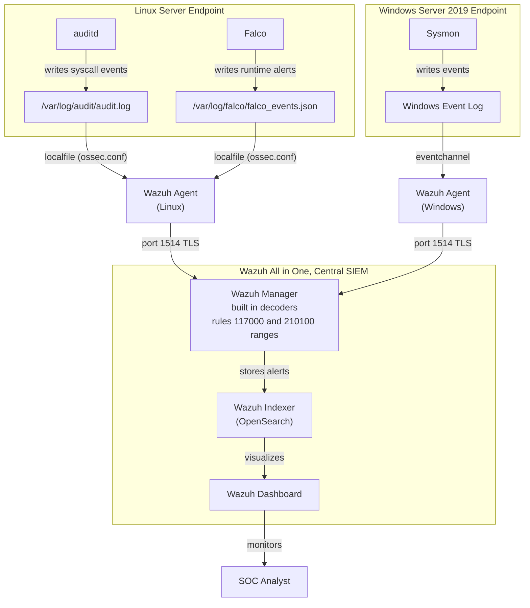

# Log Flow

## How Data Moves Through the Lab

This document describes the path logs take from their source to the Wazuh Dashboard. It is
the detailed view of the architecture diagram in the README, so the host names and the
transport labels match it.

## Linux Endpoint

1. **auditd** writes syscall events to `/var/log/audit/audit.log`
2. **Falco** writes runtime alerts as JSON to `/var/log/falco/falco_events.json`, set through `file_output` in `configs/linux/falco_output_config.yaml`
3. **Wazuh Agent** reads both files via `<localfile>` entries in `ossec.conf`
4. Agent forwards events to the **Wazuh Manager** over port 1514 with TLS

## Windows Endpoint

1. **Sysmon** writes events to the `Microsoft-Windows-Sysmon/Operational` event channel
2. **Wazuh Agent** reads the event channel via `eventchannel` log format
3. Agent forwards events to the **Wazuh Manager** over port 1514 with TLS

## Processing on the Wazuh Manager

1. **Decoders** parse raw log data into structured fields
2. **Rules** evaluate decoded events and generate alerts when conditions match
3. **Alerts** are stored in the **Wazuh Indexer** (OpenSearch)
4. **Wazuh Dashboard** queries the Indexer for visualization and investigation

## Log Formats

| Source | Format                             | Wazuh log_format |
|--------|------------------------------------|------------------|
| auditd | Key and value, Linux audit format  | `audit`          |
| Falco  | JSON                               | `json`           |
| Sysmon | Windows Event Log XML              | `eventchannel`   |

Falco can also emit plain text, in which case the agent would read it as `syslog` and a
custom decoder would be needed. That is not how this deployment is configured, and the
rules depend on the JSON form, so changing the Falco output format breaks rules 117000 to
117003.

## Notes

* Falco writes JSON here, so Wazuh parses it with the built in JSON decoder and no custom decoder is involved.
* auditd uses its own format (`type=SYSCALL msg=audit(...)`) which Wazuh has built in decoders for.
* Sysmon events through `eventchannel` are parsed by Wazuh's built in Windows decoders.
