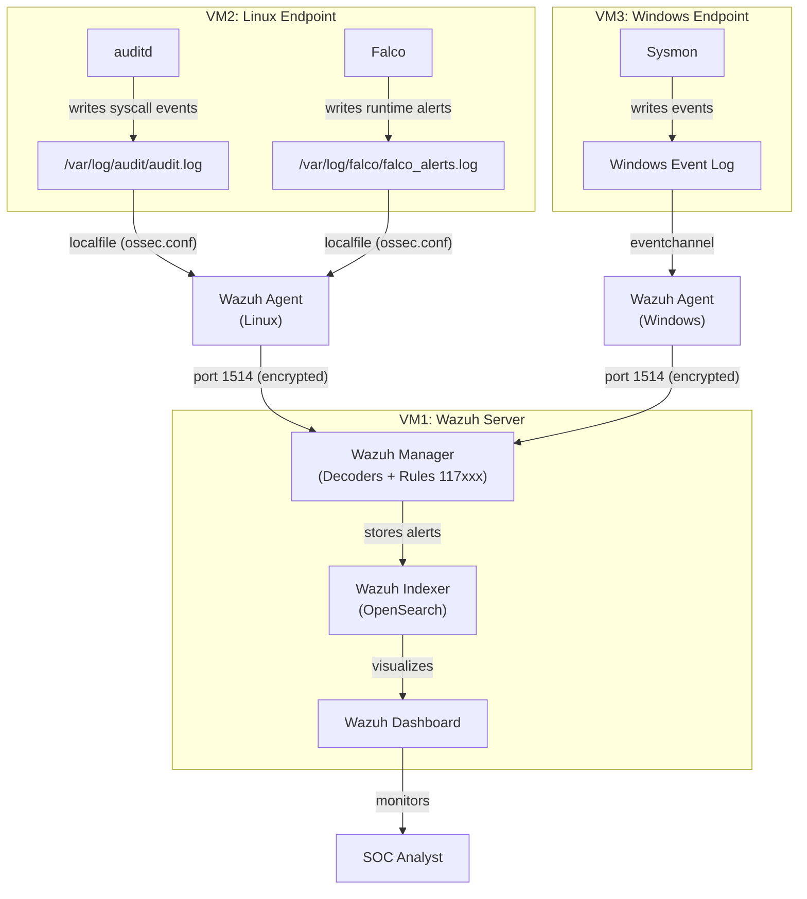

# Log Flow

## How Data Moves Through the Lab

This document describes the path logs take from their source to the Wazuh Dashboard.

## Linux Endpoint (VM2)

1. **auditd** writes syscall events to `/var/log/audit/audit.log`
2. **Falco** writes runtime alerts to its configured log file (e.g., `/var/log/falco/falco_alerts.log`)
3. **Wazuh Agent** reads both files via `<localfile>` entries in `ossec.conf`
4. Agent forwards events to **Wazuh Manager** on VM1 over port 1514 (encrypted)

## Windows Endpoint (VM3)

1. **Sysmon** writes events to the `Microsoft-Windows-Sysmon/Operational` event channel
2. **Wazuh Agent** reads the event channel via `eventchannel` log format
3. Agent forwards events to **Wazuh Manager** on VM1 over port 1514 (encrypted)

## Processing on Wazuh Manager (VM1)

1. **Decoders** parse raw log data into structured fields
2. **Rules** evaluate decoded events and generate alerts when conditions match
3. **Alerts** are stored in the **Wazuh Indexer** (OpenSearch)
4. **Wazuh Dashboard** queries the Indexer for visualization and investigation

## Log Formats

| Source | Format                         | Wazuh log_format   |
|--------|--------------------------------|--------------------|
| auditd | Key-value (Linux audit format) | `audit`            |
| Falco  | JSON or text (configurable)    | `json` or `syslog` |
| Sysmon | Windows Event Log XML          | `eventchannel`     |

## Notes

- If Falco is configured to output JSON, Wazuh can parse it directly. Plain text output may need custom decoders.
- auditd uses its own format (`type=SYSCALL msg=audit(...)`) which Wazuh has built-in decoders for.
- Sysmon events through `eventchannel` are parsed by Wazuh's built-in Windows decoders.
